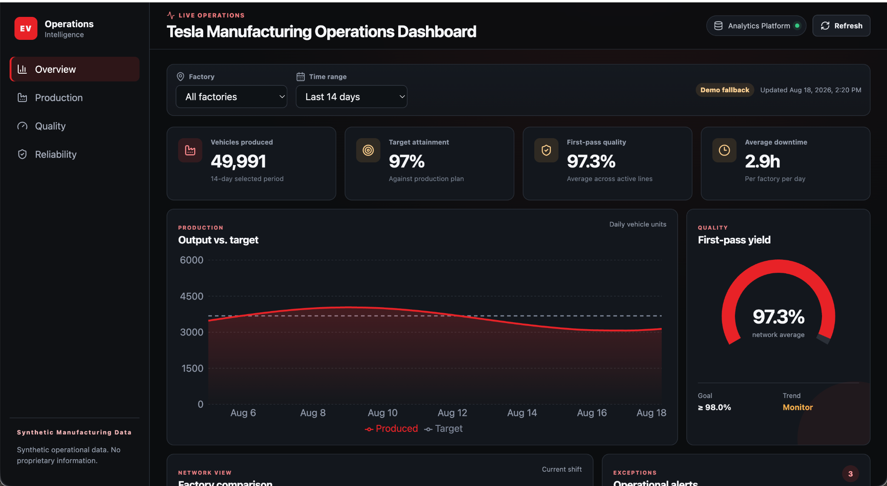

# ⚡ EV Manufacturing Operations Dashboard

A React and Flask application for exploring synthetic factory production, target attainment, first-pass quality, downtime, alerts, and line status.

> The data is generated for this repository. It is not Tesla operational data, and the application is not connected to Tesla systems.



## Business question

Manufacturing teams need one place to compare output with plan, spot quality or downtime changes, and identify the lines that need attention. This application models that workflow with a small API and a responsive dashboard.

## Implemented architecture

```text
Flask synthetic operations API
          ↓ /api/dashboard
React data service ── API unavailable ──→ labeled demo fallback
          ↓
KPI cards, trends, factory comparison, alerts, operations table
```

## Technology

| Layer | Technology |
|---|---|
| UI | React, Vite, Recharts |
| API | Flask, Flask-CORS |
| Tests | Vitest and pytest |
| CI | GitHub Actions |
| Data | Deterministic synthetic factory records |

Kafka, Spark, a warehouse, and cloud deployment are possible extensions; they are not implemented here.

## Run locally

```bash
./setup.sh
./run.sh
```

Or start each layer manually:

```bash
python -m venv .venv
source .venv/bin/activate
pip install -r server/requirements.txt
python server/app.py
```

In another terminal:

```bash
npm ci
npm run dev
```

The frontend is served by Vite and proxies `/api` requests to Flask.

## API

- `GET /api/health`
- `GET /api/dashboard?factory=All&days=14`

Valid factories are All, Fremont, Austin, Berlin, and Shanghai. The `days` value must be between 1 and 90. Invalid filters return HTTP 400.

## Decision flow

1. Select a factory and time window.
2. Compare production with target.
3. Review quality and downtime.
4. Compare factories.
5. Inspect severity-ranked alerts.
6. Filter the operations table and export the visible rows.

## Tests

```bash
python scripts/validate_project.py
source .venv/bin/activate
pytest -q
npm test -- --run
npm run build
```

Python tests cover API health, dashboard schema, filtering, and invalid parameters. Vitest covers table filtering, number formatting, and CSV export. CI runs all checks on pushes and pull requests.

## Result interpretation

The displayed metrics are deterministic synthetic examples. They validate calculations, filtering, fallback behavior, and user flow. They should not be read as actual production, quality, or downtime results.

## Production gaps

A deployed manufacturing product would need authenticated source APIs, governed metric definitions, freshness SLAs, lineage, access controls, alert ownership, observability, and audited historical storage.
